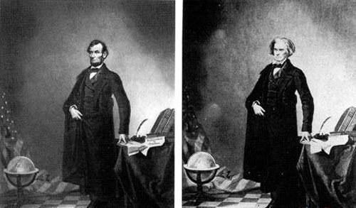

# Fake Media 的概念

## Media 的定义

媒体（media）一词来源于拉丁语“Medius”，意为两者之间。媒体是传播信息的媒介。它是指人借助用来传递信息与获取信息的工具、渠道、载体、中介物或技术手段，也指传送文字、声音等信息的工具和手段。也可以把媒体看作为实现信息从信息源传递到受信者的一切技术手段。媒体有两层含义，一是承载信息的物体，二是指储存、呈现、处理、传递信息的实体。

国际电话电报咨询委员会CCITT（Consultative Committee on International Telephone and Telegraph，国际电信联盟ITU的一个分会）把媒体分成5类：

1. 感觉媒体（Perception Medium）：指直接作用于人的感觉器官，使人产生直接感觉的媒体。如引起听觉反应的声音，引起视觉反应的图像等。
2. 表示媒体（representation Medium）：指传输感觉媒体的中介媒体，即用于数据交换的编码。如图像编码（JPEG、MPEG等）、文本编码（ASCII码、GB2312等）和声音编码等。
3. 表现媒体（Presentation Medium）：又名“显示媒体”，指进行信息输入和输出的媒体。如键盘、鼠标、扫描仪、话筒、摄像机等为输入媒体；显示器、打印机、喇叭等为输出媒体。
4. 存储媒体（Storage Medium）：指用于存储表示媒体的物理介质。如硬盘、软盘、磁盘、光盘、ROM及RAM等。
5. 传输媒体（Transmission Medium）：指传输表示媒体的物理介质。如电缆、光缆等。

而我们本次要讨论的Fake Media则属于表示媒体，主要是可以通过电视、报刊、网络、电台传播的图像、音频、视频等媒体介质。

## Fake Media的概念

传统的Media（媒体）是直接收集于现实世界的，比如直接拍摄的照片、录制的视频、音频。而Fake Mida则是与直接采集于现实世界的Media相对的，人为修改过或者人为合成的Media。

# 矛与盾

## 制作Fake Media的典型技术与发展现状

在网络盛行的今天，图片、音频与视频占据了除文本外主要的传播媒体内容，所以本文将从这三个方面介绍Fake Media的典型技术与发展现状。

### 图片

#### 软件出现前的Fake Image技术与发展

在Photoshop等图片处理软件出现前，制作Fake Images主要通过暗房技师在暗房冲洗阶段进行。如在“负片”阶段，可以人为涂黑或涂白，从而实现对最终照片编辑。也可以实现扣取和拼接，从而通过多张照片合成想要的照片。

1860年，为显示林肯的伟岸和豪迈，暗房技师将卡尔霍恩肖像中的头颅抠取替换，直接装上了林肯。 其次，通过叠放套放的手法，能够把多张胶片合成到一张照片上。在彩色冲印普及之前，1842年，英国人理查德贝尔德就发明了为照片着色的技术。 在1900年代左右，商业摄影师可以使用不同的图像将家庭成员聚集在一起。

#### 借助软件的Fake Image的技术与发展

1987年Thomas和John Knoll开发了著名的图像处理软件Photoshop，随后该软件被Adobe收购。Photoshop的出现，开创了通过电脑软件处理图片的新时代，通过Photoshop，用户可以对拍摄的照片进行后期处理，也可以讲不通的照片的对象扣取拼接组合，进行创作。

除此之外，随着图像处理软件的发展，传统的绘画可以与软件相结合，人们可以不在受限于对拍摄的照片的修改，画师可以通过软件进行绘画，创造出以假乱真的数字图像创作。

同时，在泛娱乐化的当今时代，图片也不再仅限于照片，截图等数字图像也成为一种重要信息传播载体，而通过图像处理软件可以轻易的对这类图片进行修改和伪造。

#### 借助深度学习与人工智能的技术与发展

随着深度学习的发展，人们已经可以通过神经网络合成出照片级别的人脸图片，到2010年代末，深度学习人工智能已被应用于合成看起来像人类的图像和视频，一旦训练阶段完成，就不需要人工帮助。

 [This Person Does Not Exist](https://en.wikipedia.org/wiki/This_Person_Does_Not_Exist) 则是一个使用GAN（生成对抗网络）产生从不会存在的人为合成的人像的网站。

### 音频

目前的Fake Audio技术主要有语音合成、语音转换技术。

语音合成是指根据给定的语言内容合成目标说话人风格的语音，实现文本到声音的映射。

传统语音合成主要包括波形拼接法和参数生成法。波形拼接语音合成将自然语音数据中的语音单元按照一定的规则拼接，合成与目标说话人高度相似且自然的语音，包括语料库收集、声学单元选取、拼接伪造等步骤。

随着深度学习技术的发展，近年来的语音合成技术基本采用深度学习方法，主要包括管道式(Pipeline)语音合成和端到端式语音合成两类。

语音转换是指将源说话人的语音转换为目标说话人风格的语音，实现声音到声音的映射。

典型的语音转换模型如图3所示，包括语音分析、映射和波形重构三个主要环节。语音分析将源说话人的语音提取出中间特征表示(超节段、分段信息),映射模块将源说话人特征转换为目标说话人特征，重建模块将目标说话人特征重构成语音波形信号。

近年随着深度学习技术的快速发展，自动编码器(AutoEncoder)、生成对抗网络(Generative Adversarial Network, GAN)等可实现序列到序列高精度转换的神经网络技术在语音转换领域取得了良好的应用效果。目前主流的语音转换技术都基于深度学习方法，根据转换任务的不同，可分为一对一转换、多对多转换和少样本转换。

### 视频

目前的Fake Video技术可以分为两个方面，一是在影视特效中大量使用的CGI特效技术，二是近年来兴起的结合深度学习的自编码器将源人脸替换到目标人脸的的Deepfake人脸篡改技术。

CGI技术全称为Computer Generated Images技术，CGI的历史可以追溯到1950年代，当时机械计算机被重新用于在动画上创建图案，然后将其合并到故事片中。但是真正促使CGI时代到来的还是乔治·卢卡斯执导的《星球大战》，其创立的工业光魔公司，将特效影视带到了一个新高度。此后CGI技术已经被大量的使用，人们可以利用CGI技术在影视作品中创造出以假乱真的视频画面。

DeepFake最初是在2017年由国外Reddit用户"deepfakes"提出，是基于深度学习的自编码器将源人脸替换到目标人脸的操作。其核心原理是利用生成对抗网络或者卷积神经网络等算法将目标对象的面部“嫁接”到被模仿对象上。由于视频是连续的图片组成，因此只需要把每一张图片中的脸替换，就能得到变脸的新视频。具体而言，首先将模仿对象的视频逐帧转化成大量图片，然后将目标模仿对象面部替换成目标对象面部。最后，将替换完成的图片重新合成为假视频，而深度学习技术可以使这一过程实现自动化。

## 良性应用实例以及对人类发展的意义

合理的使用Fake  Media技术可以为人们生活带来许多的便利和新意。

利用Fake Image技术，人们可以实现对图片的修改。对于摄影而言，可以通过Photoshop等修图软件对拍摄的照片进行后期，从而实现消除瑕疵、美化图片、后期创作等功能。同时人们也可以通过图像处理软件进行创作。

同时，通过人工智能创造逼真的但是却真实不存在的人像图片，可以用来作为影视作品的遗像素材，这也是一种好的利用。

对于Fake Audio而言，如今良性应用最多的就是语音合成技术，即文本内容转换成语音。如今许多公司的智能语音助手，都利用了这项技术。同时，这项技术对于盲人或者语言障碍的人也有着极大的用途，盲人可以通过这项技术“阅读文本”，而有语言障碍的人可以通过这项技术和他人“说话”。

对于Fake Video而言，目前最大的应用无疑是影视行业，大量的CGI技术的使用，扩大了人们的创作局限，越来越多的现实中不可能出现的场景可以通过CGI技术逼真的展现出来。著名电影《速度与激情7》拍摄还没完成，由于主演保罗沃克不幸车祸离世，剧组从前六部《速度与激情》未使用的镜头中选择符合未拍摄剧本所需的表情和动作，通过转换从而生成数字成像模型，再通过CG渲染出虚拟的保罗。在替身演员进行肢体动作的拍摄后，CG技术会对图像进行脸部替代，从而让保罗在银幕上重生。而声音部分，也采用同样的方式进行采集和重编。最终完成了电影的拍摄。

## 恶意使用实例以及对人类社会产生的危害

Fake Media最大的恶意使用就是利用该技术进行音视频以及图片的伪造。不法分子可以利用伪造的语音进行诈骗犯罪，可以利用伪造的图片和视频进行恶意宣传和诽谤。而在自媒体盛行的今天，有些短视频创作者为了流量，不惜用造假视频博人眼球。

恶意用户利用深度伪造制造和传播虚假信息，攻击个人、报复社会，甚至引发政治争端，这给网络安全领域带来了严峻挑战

根据《福布斯》获得的一份法庭文件披露的信息，一个欺诈团伙利用音频深度伪造技术克隆了一家企业董事的声音，将3500万美元的资金转移到几个海外账户。这是迄今为止最成功的“deep voice” 欺诈案，尽管这可能只是这样的案例日益增长趋势的一部分。

## 防范恶意使用的技术手段、技术规范与法律建设情况

在Deepfake技术迅速发展的同时，相应的利用深度学习进行伪造检测的技术也在发展。

其次，相应的技术规范也已经被制定出来，C2PA联盟发布了用以对抗深度伪造技术（Deepfake）的数字内容认证技术规范的第一版。该标准将允许内容创建者和编辑者创建无法秘密篡改的媒体内容。也允许他们有选择性地披露关于谁创建或更改了数字内容以及如何更改的信息。平台可以定义与每种类型的资产相关联的信息——例如，图像、视频、音频或文本，以及如何呈现和存储这些信息，以及如何识别篡改证据。

但是，目前还没有专门针对于这项技术的法律法规。这一点还有待完善。

# 你对 Fake Media 的认识

科技是一把双刃剑，这句话放在Fake Media上也同样适用，如果使用的当的话，这项技术可以为人们带来更多的是便利和新的创造。但是同时如果这项技术被恶意使用，也会为社会带来隐患和危害。这个时候除了需要技术使用者具有自觉和良知以外，还需要政府和社会具有良好的监管和监督。才能让这项技术更好服务于人类。

# 参考资料

[1]任延珍,刘晨雨,刘武洋,王丽娜.语音伪造及检测技术研究综述[J].信号处理,2021,37(12):2412-2439.

[2]其他资料来源于百度、Google以及知乎。

