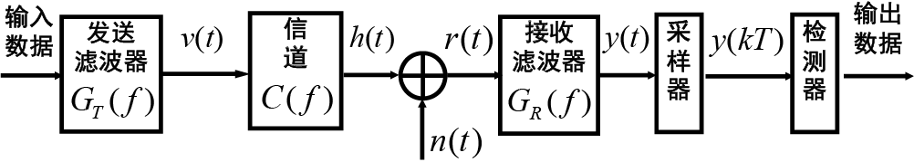
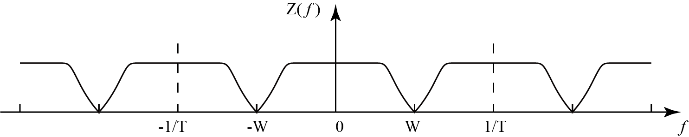
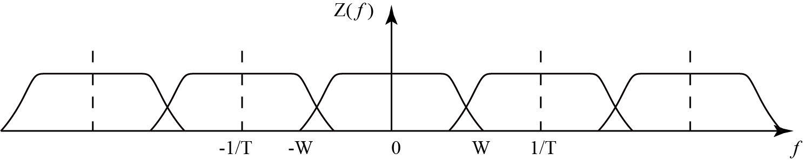

# 第6章 数字基带传输

## 6.1 数字基带信号及其频谱特征

### 一、基本基带信号波形

### 二、数字脉冲幅度调制（PAM）信号的功率谱

由于理想方波脉冲**频带无限宽**，需要通过**脉冲成型滤波器**成为**有限带宽**的基带信号。

> 插图

$$
a\{n\} &=& \sum_{n = -\infty}^{\infty} a_n \delta(t-nT) \\
g(t) &\rightarrow & G(f) \\
V(t) &=& \sum_{n = -\infty}^{\infty} a_ng_T(t-nT)
$$

可以得到PAM信号$V(t)$的功率谱为：
$$
S_v(f) = \frac{1}{T}S_a(f) \cdot|G_T(f)|^2
$$
其中$S_a(f)$为随机序列$a\{n\}$的功率谱，$|G_T(f)|^2$是脉冲成型滤波器的功率谱。

**考虑最简单的情况：$a\{n\}$独立同分布序列时：**
$$
S_{V}(f)=\frac{\sigma_{a}^{2}}{T}\left|G_{T}(f)\right|^{2}+\frac{m_{a}^{2}}{T^{2}} \sum_{m=-\infty}^{\infty}\left|G_{T}\left(\frac{m}{T}\right)\right|^{2} \delta\left(f-\frac{m}{T}\right)
$$

> 其中第一项是连续谱，第二项是离散谱线，频率间隔为$\displaystyle \frac{1}{T}$，若选$a\{n\}$的均值为0，则可以消除离散谱线，只剩下连续谱。

## 6.2 常见的数字序列码型

见书

## 6.3 基带信号通过加性高斯噪声（AWGN）信道传输

假设传输噪声干扰为高斯噪声，传输信道带宽无限（即不存在码间干扰）。

### 一、解调和检测

解调：把接收到的波形恢复成发送的基带脉冲

检测：判断确定波形代表的数字含义

本节考虑简化后的二进制基带传输模型，如下图所示

> 插图

接受滤波器进行波形恢复，经过采样后由门限判决得到消息信号。

### 二、信号和噪声的矢量空间表示

掌握如何通过施密特正交化表示信号和噪声。

### 三、基函数相关解调

M个传输信号：$s_k(t) ,\, (k = 1,2,...,M)$，可以构造出N个正交规范基函数：$\{\phi_i(t), i = 1,2,...,N\, (N\le M)\}$

输出信号：$r(t) = s_k(t) + n(t)$

则
$$
正交基函数：\{\varphi_i(t), i = 1,2,...,N\, (N\le M)\} \\
发送信号矢量表示：\boldsymbol{s}_k = (s_{k1},s_{k2},...,s_{kN}) \\
接收信号矢量表示：\boldsymbol{r}_i = (r_{1},r_{2},...,r_{N}) \\
其中：s_{ki} = \int_{0}^{T}s_k(t)\phi_i(t)dt,\, r_{i} = \int_{0}^{T}r(t)\phi_i(t)dt = s_{ki}+n_i
$$
则可以用如下相关器解调：

> 插图

### 四、匹配滤波器

#### 1 定义

若$s(t)$定义在$0\leq t \leq T$上，则其匹配滤波为：
$$
h(t)=\begin{cases} 
	s(T-t) &,\quad 0\leq t \leq T\\
  0&,\quad else \end{cases}
\quad k = 1,2,...,N
$$

#### 2 性质

如果信号收到AWGN信号干扰，则信号通过与s(t)相匹配的滤波器，可获得最大输出信噪比。

#### 3 传递函数$H(f)$

若：
$$
h(t)=\begin{cases} 
	c\cdot s(T-t) &,\quad 0\leq t \leq T\\
  0&,\quad else \end{cases}
$$
则传递函数为：
$$
H(f) = c \cdot S^*(f)e^{-2\pi fT}
$$
其中$S(f)$为$s(t)$的频谱。

#### 4 信号输出

$s(t)$通过匹配滤波器的输出为：
$$
\begin{aligned}
y_s(t) &= s(t) * h(t) \\
			 &=	R_s(t-T)
\end{aligned}
$$

> 注意只有在$t=T$的时候匹配滤波器的输出才和相关器的输出相同。其他时刻不一定相同。

### 五、基函数匹配滤波器解调

> 可以用一组滤波器代替相关器

滤波器脉冲响应为：
$$
h(t)=\begin{cases} 
	\varphi_k(T-t) &,\quad 0\leq t \leq T\\
  0&,\quad else \end{cases}
\quad k = 1,2,...,N
$$
其中$\varphi _k(t)$是N个基函数

所以滤波器输出为：
$$
\begin{aligned}
y_k(t) &= r(t) * h_k(t) \\
			 &= \int_{0}^{t}r(\tau)h_k(t-\tau)d\tau \\
			 &= \int_{0}^{t}r(\tau)\varphi_k(T- t + \tau)d\tau, \, k = 1,2,...,N
\end{aligned}
$$
当$t = T$时，匹配滤波器的输出正好是N个基函数相关器的输出。

### 六、最佳检测判决器

相关解调和匹配滤波都产生一个判决矢量
$$
\mathbf{r} = (r_1, r_2,...,r_N) = \mathbf{s}_m + \mathbf{n}
$$
在信号空间里，$\mathbf{s}_m$视为一点，则$\mathbf{r}$可以表示为$\mathbf{s}_m$上叠加球对称分布的噪声$\mathbf{n}$。噪声奉茶$N_0/2$决定了围绕$\mathbf{s}_m$的噪声云团的密度和大小。

如何设计是的判决概率最大：采用最大后验概率最大。

最终公式：
$$
\arg \max _{m}\left\{\ln p\left(\mathbf{s}_{m}\right)-\frac{1}{N_{0}} \sum_{i = 1}^{N} s_{m i}^{2}+\frac{2}{N_{0}} \sum_{i = 1}^{N} r_{i} s_{m i}\right\} \\ 
= \arg \max _{m}\left\{\ln p\left(\mathbf{s}_{m}\right)-\frac{E_{m}}{N_{0}}+\frac{2}{N_{0}}\left(\boldsymbol{r}, \mathbf{s}_{m}\right)\right\}
$$
由此可以构建基函数相关解调和基函数匹配滤波的最佳检测判决器如下：

### 七、AWGN上信号检测的错误（误符号）概率计算

见书上例题。

## 6.4 数字基带信号通过带限信道传输

前一节信道为AWGN信道，带宽无限制，相当于只加了一个高斯噪声。此节讨论的是线性带限信道，相当于在加噪声前先通过一个线性滤波器。

#### 一、数字信号通过带限信道传输

信号波形：$g_T(t)$（此处只分析信道，所以用发送滤波器的波形作为信道输入）

线性带限信道：$c(t) \rightarrow C(f)$

通过信道输出：$h(t) = c(t)*g_T(t) \quad H(f) = C(f) G_T(f)$

加入高斯噪声：$r(t) = h(t)+n(t)$

接受滤波器采用匹配滤波器以获得最大输出信噪比：$G_R(f) = H^*(f)e^{-j2\pi f t_0}$

输出的信号分量在$t_0$的采样值为：$y_s(t_0) = \int_{-\infty}^{\infty}|H(f)^2|df = E_h$

信号功率为：$E_h^2$

输出高斯噪声是均值为零，功率谱密度为：$S_n(f) = \displaystyle \frac{N_0}{2}|H(f)|^2$

噪声功率为：$\sigma ^2 = \int_{-\infty}^{\infty} S_n(f) df =  \displaystyle \frac{N_0EH_h}{2}$

匹配滤波器输出信噪比为：$(\displaystyle \frac{S}{N}_o) = \frac{E_h^2}{N_0E_h/2} = \frac{2E_h}{N_0}$

#### 二、码间干扰

考虑PAM信号。

输入$a\{n\}$，则发送滤波器输出为
$$
v(t)=\sum_{n=-\infty}^{\infty} a_{n} g_{T}(t-n T)
$$
将发送滤波器与信号看成一个滤波器则其传递函数为：
$$
h(t)=c(t) \otimes g_{T}(t)
$$

则信号输出为：
$$
r(t)=\sum_{n=-\infty}^{\infty} a_{n} h(t-n T)+n(t) \\
$$
通过接受滤波器输出为：
$$
y(t) = \sum_{n = -\infty}^{\infty}a_nx(t-nT) +\xi(t) \\
$$
其中：$x(t)$为三个滤波器看成一个滤波器的传递函数, $\xi(t)$为噪声通过接收滤波器后的输出：
$$
x(t) = h(t) * g_R(t) = g_T(t) * c(t) * g_R(t) \\
\xi (t) = n(t) * g_R(t)
$$
对$y(t)$采样后的采样值为：
$$
y(mT) = \sum_{n = -\infty}^{\infty}a_nx(mT-nT) +\xi(mT) \\
简写为：\\
y_m = \sum_{n = -\infty}^{\infty}a_nx_{m-n} +\xi_m = x_0a_m + \sum_{n \neq m} a_n x_{n-m} + \xi _m \\
$$
其中：

**有用信号及其功率：**

$ x_0a_m$  为**有用信号**，当接收滤波器与接收信号$h(t)$匹配时，有
$$
E_h = x_0 = \int_{-\infty}^{\infty} h^{2}(t) d t=\int_{-\infty}^{\infty}|H(f)|^{2} d f \\
=\int_{-W}^{W}\left|G_{T}(f)\right|^{2} \cdot|C(f)|^{2}df
$$
**噪声信号及其功率：**

$ \xi _m$为**噪声干扰**，其功率为$\sigma_{\xi}^{2} = \displaystyle \frac{N_0}{2}E_h$

**码间干扰及其消除：**

$ \sum_{n \neq m} a_n x_{n-m} $为码间干扰，可以通过适当设计接受滤波器和发送滤波器，使得$n\leq 0$时，$x_n = 0$，从而消除码间干扰。

#### 三、眼图

眼图就是把每个区间的波形叠加在一起。

1. “眼睛”张开最大时刻是最佳采样时刻；
2. 中间水平横线表示最佳判决门限电平； 
3. 阴影区的垂直高度表示接收信号峰值失真范围
4. 水平横线上非阴影区间长度的一半表示定时误差容限；而“眼睛” 斜边的斜率表示定时灵敏度，斜率越大，对定时误差灵敏度越高； 
5. 在无噪声时，眼睛张开程度，即抽样时刻上下阴影区间距离一半 表示噪声容限；若在抽样时刻，噪声值大于这个容限，则发生误判；
6. 一般M电平PAM眼图有M-1只眼睛；

#### 四、无码间干扰带限信号设计准则——奈奎斯特准则

对于接受滤波器采样信号输出：
$$
y_m = \sum_{n = -\infty}^{\infty}a_nx_{m-n} +\xi_m = x_0a_m + \sum_{n \neq m} a_n x_{n-m} + \xi _m \\
$$
 无码间干扰的充要条件：
$$
x(n T)=\left\{\begin{array}{ll}
1 & n=0 \\
0 & n \neq 0
\end{array}\right.
$$
奈奎斯特准则：
$$
x(n T)=\left\{\begin{array}{ll}
1 & n=0 \\
0 & n \neq 0
\end{array}\right.
 \quad \Leftrightarrow  \quad \sum_{m=-\infty}^{\infty} X\left(f+\frac{m}{T}\right)=T
$$
有关上式的讨论：

因为$X(f) = G_T(f)C(F)G_R(F)$，则假定$C(f) = 0, \quad |f| > W$，则$X(f) = 0, \quad |f|>W$

1. $T< \displaystyle \frac{1}{2W}$，即$\displaystyle \frac{1}{T} > 2W$

这种情况下，因为$X\left(f+\displaystyle \frac{m}{T}\right)$是$X(f)$的平移叠加，此时平移间隔$\displaystyle \frac{1}{T}$大于$2W$，则无论如何平移都会出现空隙，是的无法叠加满足$X\left(f+\displaystyle \frac{m}{T}\right)=T$条件。

2. $T = \displaystyle \frac{1}{2W}$，即$\displaystyle \frac{1}{T} = 2W$

此时平移间隔正好等于2倍的带宽，此时只能有当
$$
X(f)=\left\{\begin{array}{ll}
T & , \quad|f|<W \\
0 & , \quad else
\end{array}\right.
,\qquad
x(t) = sinc(\frac{t}{T})
$$
时，才能满足$X\left(f+\displaystyle \frac{m}{T}\right)=T$，使得无码间干扰。而要满足此式，现实中是很难的。

3. $T> \displaystyle \frac{1}{2W}$，即$\displaystyle \frac{1}{T} < 2W$

此时有重叠，可以通过设计使得重叠部分之和刚好等于$T$，从而满足$X\left(f+\displaystyle \frac{m}{T}\right)=T$条件。

并且当符号时间间隔是$T$时，符号率$R_B = 1/T$，所以可知符号率不可能大于信道带宽的2倍，即信道传输最高码率为
$$
R_B/W = 2 (波特/Hz)
$$

#### 五、升余弦频谱信号

上一节讲到，当$T> \displaystyle \frac{1}{2W}$，即$\displaystyle \frac{1}{T} < 2W$时，可以通过设计信号波形使得满足$X\left(f+\displaystyle \frac{m}{T}\right)=T$条件，从而达到无码间干扰。而升余弦频谱信号是最常用的一种无码间干扰波形，其频率响应如下：
$$
X_{r c}(f)=\left\{
\begin{array}{cc}
T, & 0 \leq|f| \leq(1-\alpha) / 2 T \\
\frac{T}{2}\left[1+\cos \frac{\pi T}{\alpha}\left(|f|-\frac{1-\alpha}{2 T}\right)\right], & \frac{1-\alpha}{2 T} \leq|f| \leq \frac{1+\alpha}{2 T} \\
0, & |f|>\frac{1+\alpha}{2 T}
\end{array}\right.
$$

#### 六、具有零码间干扰的数字PAM系统的差错概率

